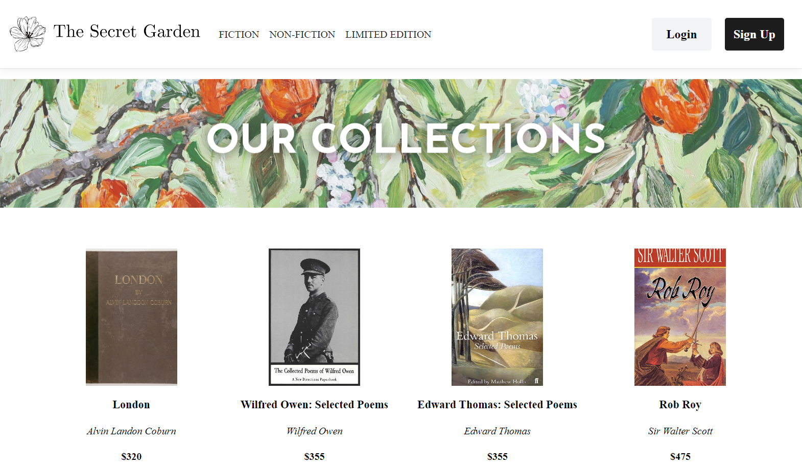
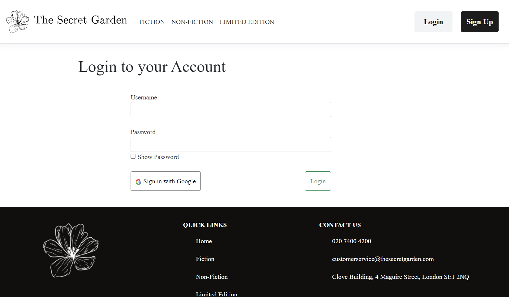
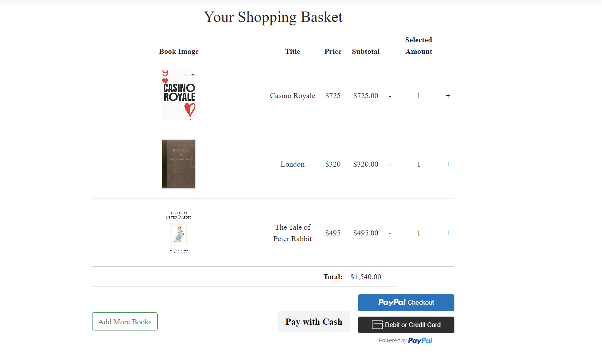
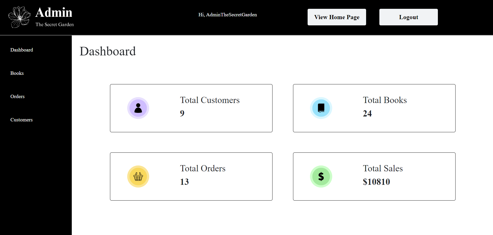
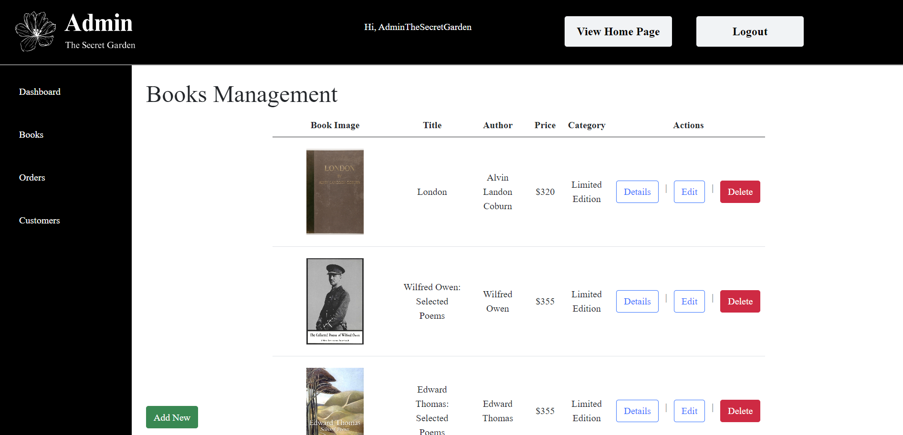
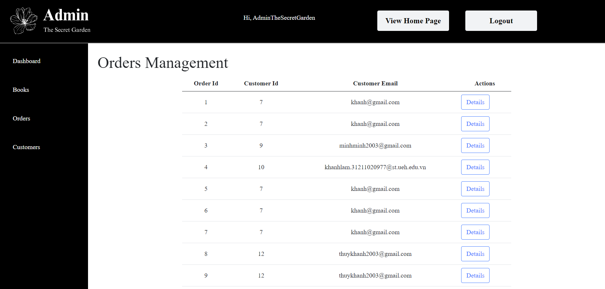
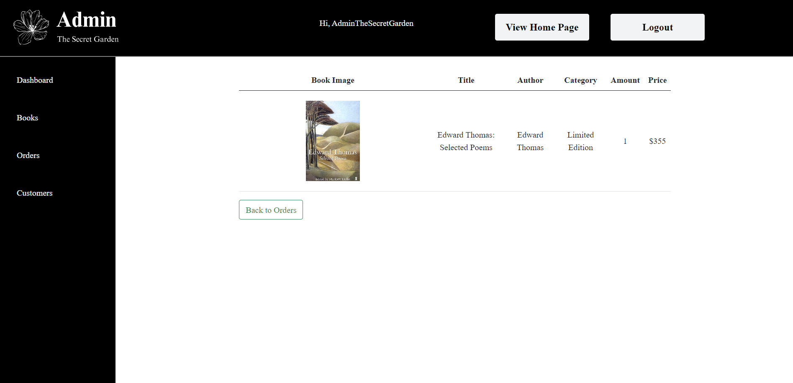
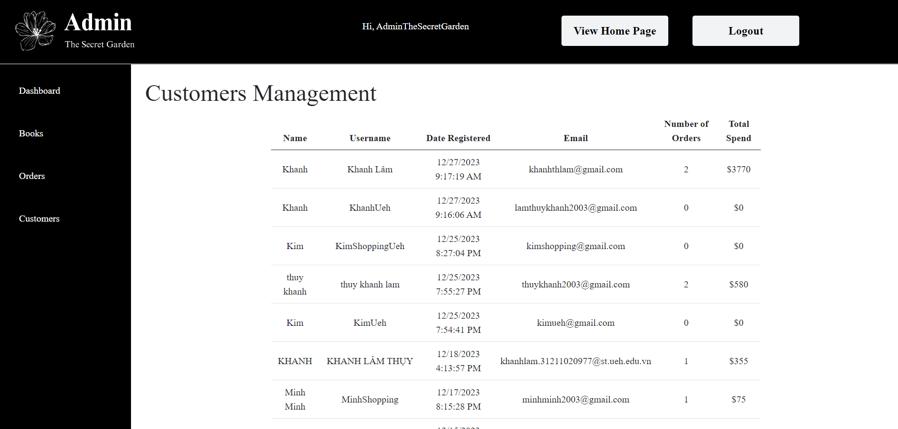

# Develop an e-commerce web application selling books online
*This project serve as the final project for UEH E-Commerce Web Application University Course. This project is the result of a 6-person team in which I was a member as well as team leader.*  

## Main Objective
The main objective of this project is to develop an online book store for the brand "The Secret Garden".  

## Brief Introduction of the Brand
"The Secret Garden" is a made-up brand that primarily sells books. They want to have an online store so that they can sell even more books to customers. They also want to keep a record of all their books, customers and sales they've made on this e-commerce store. 

## Overview of the Web Application
### Tools Used
+ Visual Studio 2022
+ SQL Server Management Studio 19
+ HTML/CSS/JavaScript/ASP.NET Core MVC
### Database
+ Create a database for all of "The Secret Garden"'s books
+ Utilize CRUD operations to allow the web application to interact with the database of books, customers, and orders
### Functions
The web application allows different functions based on the type of users they are:  
#### Admin
The admin can only enter the admin page if they enter the correct log in information. Admin has access to the following pages and functions.  
+ Admin has access to the administration page
+ Admin can manage the store's book inventory, they can create, update or delete any book they want
+ Admin can manage book orders placed by customers
#### Customers
+ Customers can view the store's book catalogue and be able to read the product description and information of each book
+ Customers can create an account on the store either through entering their email and password or through Google
+ Customers can add books to their cart after they have signed in to their account
+ Customers can place an order to purchase a book
+ Customers can purchase their orders through PayPal online payment gateway

## Images

*The main page of the web application*   

*The detailed product page with the product's information*   

*The log in page for users to log in to their account*   

*The shopping basket page for customer to view their chosen books*   

*The Admin dashboard page that summarize the current number of books, customers, orders and revenue*   

*The Admin books management page where Admin can create, update or delete books*   

*The Admin orders management page where Admin can view orders*   

*The Admin detailed order page where Admin can view the details relevant to the order*   

*The Admin customers management page where Admin can view the customers' information*   
